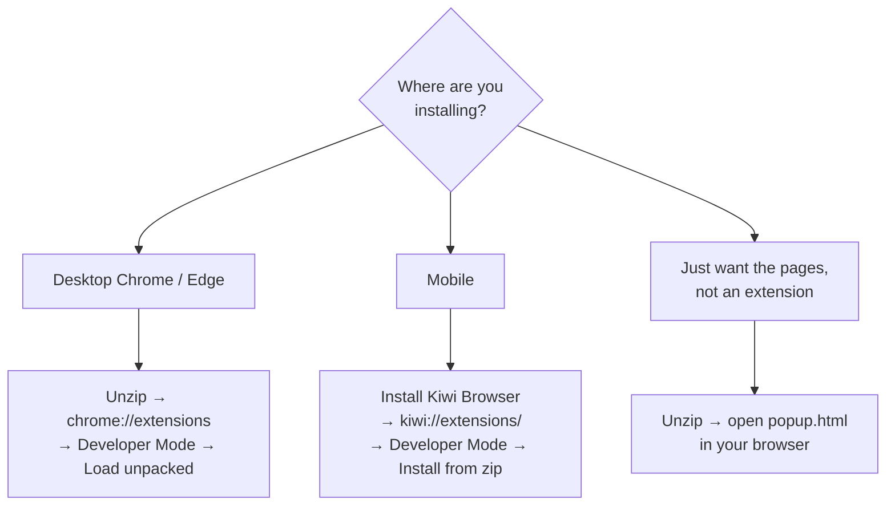

# Installation-Instructions

> Step-by-step guide for installing browser extensions on desktop (Chrome/Edge) and mobile (Kiwi), or running one as a plain website — a single shareable page you can link from any extension's README.

[](./LICENSE)
[](https://github.com/chirag127/Installation-Instructions/stargazers)
[](https://github.com/chirag127/Installation-Instructions/commits)
[](https://developer.mozilla.org/)

**Live site:** https://installation-instructions.oriz.in · **GHP landing:** https://chirag127.github.io/Installation-Instructions/ · **Repo:** https://github.com/chirag127/Installation-Instructions

If this is useful, please ⭐ [star the repo](https://github.com/chirag127/Installation-Instructions) — it helps others find it.

**100% static — no upload, no signup, free.** A plain HTML page you can deep-link from any extension's docs.

## Which path do I take?



## Instructions

### Google Chrome / Microsoft Edge on desktop

1. Unzip the file you downloaded — you should have a folder.
2. Open the extensions page: `chrome://extensions` or `edge://extensions`.
3. Enable **Developer Mode**.
4. Click **Load unpacked** and select the unzipped folder (or drag the folder onto the page). Do not delete the folder afterwards.

### Install extension on mobile

1. Install **Kiwi Browser**.
2. Go to `kiwi://extensions/`.
3. Enable **Developer Mode**.
4. Choose **Install from zip** and pick the downloaded zip.

### Use as a website

1. Unzip the file — you should have a folder.
2. Open the folder.
3. Open `popup.html`; the page opens in your browser.
4. Reload if needed. ([How to refresh a page](https://www.wikihow.com/Refresh-a-Page))

## Tech stack

Plain static HTML — no framework, no build step, no backend. Served as static files; deployed on the Cloudflare/Pages free tier.

## Repo structure

```
Installation-Instructions/
├── README.md   # the instructional content rendered on the landing page
├── CNAME       # installation-instructions.oriz.in
└── LICENSE
```

## Quick start

No build step. Either:

- **Use it live:** https://installation-instructions.oriz.in
- **Run locally:** clone the repo and open the page in your browser (or serve the folder with any static server, e.g. `npx serve`).

## Configuration

No configuration required — no env vars, no build. It is a static instructional page.

## Part of the oriz family

Installation-Instructions is one of ~80 small, single-purpose sites in the [oriz](https://blog.oriz.in) family — each doing one thing well and running **$0 on the Cloudflare free tier**. Start at the hub, [oriz-home](https://oriz.in). It's the shared "how to install" page linked from Chirag's browser-extension projects.

## Contributing

Issues and PRs welcome. Keep the instructions concise and version-agnostic. Conventional commits are the changelog.

## Status

Stable and live at https://installation-instructions.oriz.in.

## License

MIT © Chirag Singhal — chirag@oriz.in
